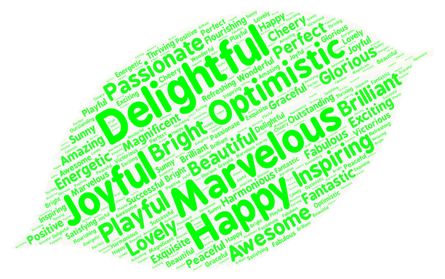
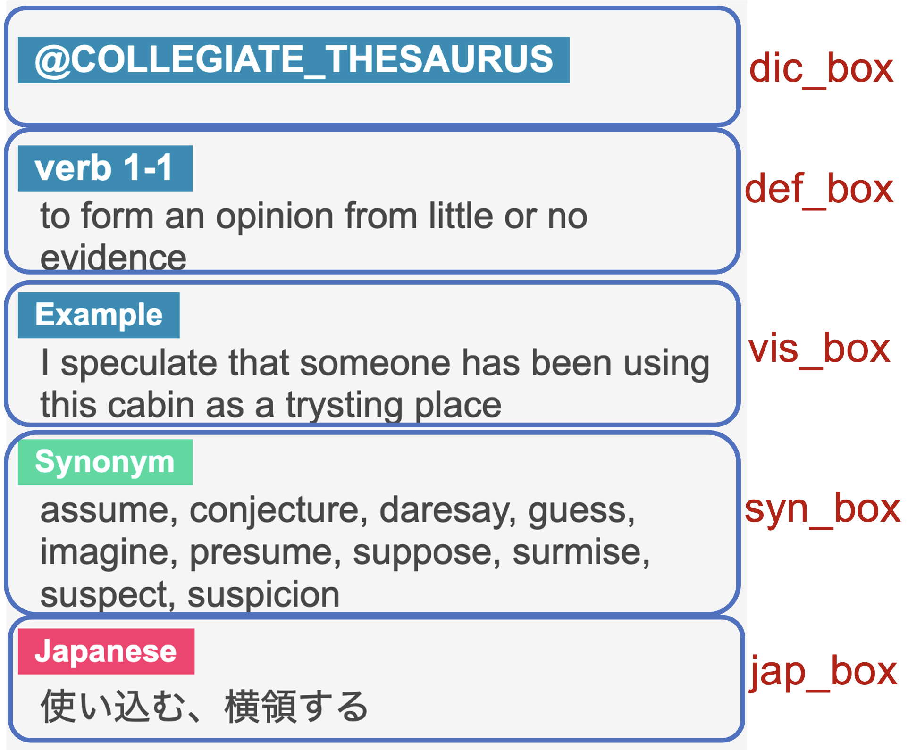

Kotonoha Anki Add-On
==========

Kotonoha is an Anki add-on that automatically adds **`pronunciation, definition, synonyms, Japanese translation`**, and other relevant info to words in the Anki card. It simplifies the process of creating flashcards, freeing up users' time to focus on learning rather than searching for definitions and pronunciations. With Kotonoha, users can easily improve their vocabulary and language skills without the hassle of tedious research.

Tested on Anki 2.1.47, 2.1.52, and 2.1.60 (doesn't work <= 2.1.44) 

**Note:** This add-on uses Merriam-Webster's Collegiate®, Collegiate® thesaurus, Medical, Learner's, intermediate thesaurus and Elementary Dictionary with Audio API to get definitions and pronunciations. This requires you sign up for a Merriam-Webster account and use your own individual API access key. Go to the [Merriam-Webster Dictionary API website](http://www.dictionaryapi.com/), sign up for an account, and request access to the dictionaries. Then, replace **`YOUR_KEY_HERE`** with the key you receive. You can add up to three dictionaries. Also, the add-on references the English-Japanese dictionary provided by [Weblio](https://ejje.weblio.jp/).

## How to use
First, set up the add-on's configuration settings. This requires entering your primary dictionary and API key for that dictionary. You can also choose to include additional dictionaries if you wish.

Once the add-on is configured, you can use it to search for the pronunciation and definitions of a word by pressing the button in the flashcard creation window. Simply select the word you want to look up (or use all the text on the front of the card), and the add-on will automatically search for and display the information you need.

**Note:**
If you're using Kotonoha, you can format your word definitions, example sentences, and synonyms in a box using CSS styling. To achieve a card format like the one shown in the image on the right, navigate to **`Add -> Cards... -> Template and Styling.`** For reference, I keep my template example in the Kotonoha directory.

[How to use Kotonoha 1](https://youtu.be/SCxYdC3GtGs "How to use Kotonoha")

[How to use Kotonoha for Medicine](https://www.youtube.com/watch?v=YEG3kYFnLKk "How to use Kotonoha")

To use Batch Kotonoha, which allows you to run Kotonoha for multiple cards at once, start by selecting the cards you want to modify in the browse window. Then, **`Edit -> Batch Kotonoha...`**. If you want to add new information to each card, simply leave the 'Overwrite' option unchecked. However, if you want to replace the old note with the new one, select 'Overwrite' before clicking on Batch Kotonoha.

[How to use Batch Kotonoha](https://youtu.be/mV1GjX9Img8 "How to use Kotonoha")

## Acknowledgement
I would like to express my gratitude to the developer of the Anki add-on [AutoDefine](https://github.com/z1lc/AutoDefine), which inspired the creation of this tool.

## License & Credits
Icon made by [WordArt](https://wordart.com/)

Code licensed under GPL v3 (https://www.gnu.org/licenses/gpl-3.0.en.html)

## Release Information

Kotonoha is not officially released to [AnkiWeb](https://ankiweb.net) yet.
