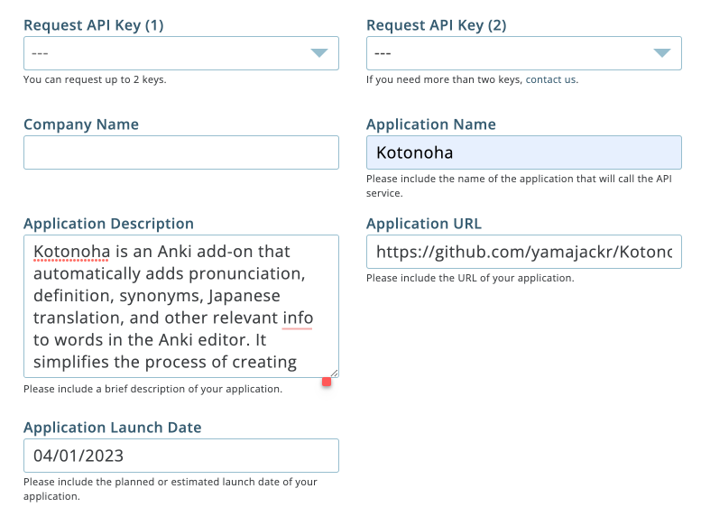

Kotonoha Anki Add-On
==========

Kotonoha is an Anki add-on that automatically adds **`pronunciation, definition, synonyms, Japanese translation`**, and other relevant info to words in the Anki card. It simplifies the process of creating flashcards, freeing up users' time to focus on learning rather than searching for definitions and pronunciations. With Kotonoha, users can easily improve their vocabulary and language skills without the hassle of tedious research.

Tested on Anki 2.1.47, 2.1.52, and 2.1.60 (doesn't work <= 2.1.44) 

**Note:** This add-on uses Merriam-Webster's Collegiate®, Collegiate® thesaurus, Medical, Learner's, intermediate thesaurus and Elementary Dictionary with Audio API to get definitions and pronunciations. This requires you sign up for a Merriam-Webster account and use your own individual API access key. 
 Go to the [Merriam-Webster Dictionary API website](http://www.dictionaryapi.com/register/index), sign up for an account, and request access to the dictionaries. Then, replace **`YOUR_KEY_HERE`** with the key you receive. You can add up to three dictionaries.
Furthermore, the add-on employs the English-Japanese dictionary provided by [Weblio](https://ejje.weblio.jp/).
It also features various modes such as 'Cloze Sentence' and 'DeepL' designed to help create effective cloze sentence flashcards. For the 'DeepL' mode, you'll need to secure a unique API key from the [DeepL API](https://www.deepl.com/pro/change-plan#developer). As of May 30, 2023, they offer a free plan for API usage.

## How to use (Configuration)
First, set up the add-on's configuration settings. This requires entering your API key for Merriam-Webster dictionary. You can also choose to include additional dictionaries if you wish.
The other available options include adding an additional search word for image search, specifying fields for inserting definitions, pronunciations, artwork and Japanese definitions, enabling/disabling opening a browser tab with an image search for the same word, setting keyboard shortcuts for running the tool. You can adjust these settings through a dialog box that pops up when you click the green leaf button, or directly in the add-on's configuration settings.

    
    

After setting up the add-on, you can easily search for word pronunciations and definitions. Just click the start button in the Kotonoha Dialog window. Choose the word you're curious about (or default to the first line of the card's source field), and watch as the add-on automatically fetches and displays all the relevant information.

[How to use Kotonoha (Default mode)](https://youtu.be/6Oqq8fuiO_k "How to use Kotonoha (Default mode)")

## **Card format:**
You can format your word definitions, example sentences, and synonyms in a box using CSS styling. To achieve a card format like the one shown in the image on the right, navigate to **`Add -> Cards... -> Template and Styling.`** For reference, I keep my template example in the Kotonoha directory.

To use Kotonoha for multiple cards simultaneously, first select the cards you'd like to modify in the browser window. Then, go to **`Edit -> Kotonoha Dialog...` from the dropdown menu, or simply use the designated short cut key)**. 

[How to use Kotonoha (Multiple cards)](https://youtu.be/xrcOHmuj-Rc "How to use Kotonoha")

[How to use Kotonoha (Cloze sentence mode)](https://youtu.be/PZi7rx1YC9w "How to use Kotonoha")

## English learning for kids
Enhance your child's education with engaging Pokemon quiz decks created using this Anki add-on. You can find the Pokemon quiz add-on at [Pokemon quiz](https://ankiweb.net/shared/info/1342621565). Simply install it to your Anki app and start enjoying interactive language learning with your child.

## Acknowledgement
I would like to express my gratitude to the developer of the Anki add-on [AutoDefine](https://github.com/z1lc/AutoDefine), [DeepL Translator](https://ankiweb.net/shared/info/972129549), which inspired the creation of this tool.

## License & Credits
Icon made by [WordArt](https://wordart.com/)

Code licensed under GPL v3 (https://www.gnu.org/licenses/gpl-3.0.en.html)

## Release Information

Kotonoha is not officially released to [AnkiWeb](https://ankiweb.net) yet.
